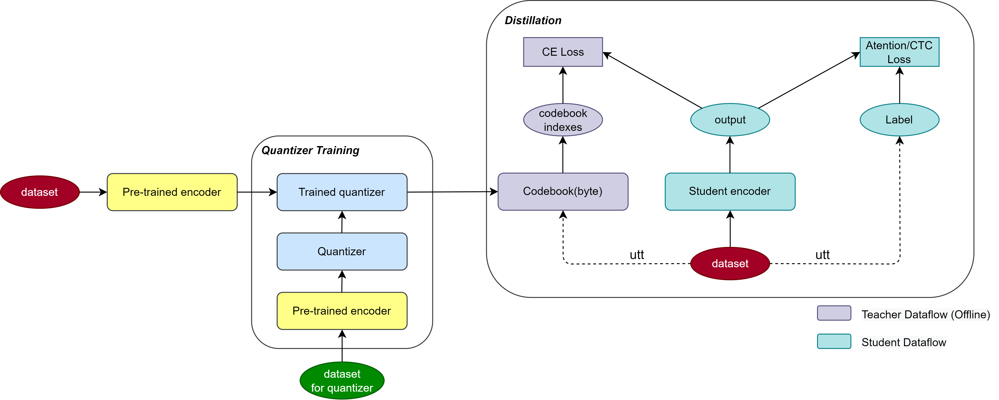

# K2码本蒸馏

## 整体流程



- 参照上图，整体流程为：**训练量化器** => **产生码本** => **蒸馏训练**

## 训练量化器

- 分为**离线训练**和**在线训练**（k2为离线训练，whisper-large-v3可用在线训练）

- 离线训练：

  1. 保存预训练模型输出至h5文件

     ```bash
     ./save_embedding.sh
         --checkpoint:            教师模型检查点路径
         --encoder_type           教师模型类型 [wenet-whisper, huggingface-whisper, hubert]
         --middle_layer           教师模型中间层序号，默认-1，即最后一层
         --save_path:             h5文件保存路径
         --train_data:            data.list文件路径
         --config:                配置文件路径
         --num_audio:             训练音频数量，默认1000
     ```

  2. 训练

     ```bash
     ./train_quantizer_offline.sh
     	--embedding_path:        h5文件读取路径
     	--save_path:             量化器保存路径
     	--quantizer_batch_size:  每步训练帧数，默认512
     	--quantizer_in_dim:      预训练模型特征维度，默认1280
     	--quantizer_out_dim:     量化器输出维度，即码本维度，默认8
     	--gpu:                   gpu序号，默认0
     ```

- 在线训练：

  ```bash
  ./train_quantizer_offline.sh
  	--checkpoint:               教师模型检查点路径
  	--encoder_type              教师模型类型，同上
  	--middle_layer              教师模型中间层序号，默认-1，即最后一层
  	--train_data:               data.list文件路径
  	--save_path:                量化器保存路径
  	--quantizer_batch_size:     每步训练帧数，默认512
  	--quantizer_in_dim:         预训练模型特征维度，默认1280
  	--quantizer_out_dim:        量化器输出维度，即码本维度，默认8
  	--train_quantizer_online:   激活参数，是否在线训练
  	--num_audio:                训练音频数量，默认1000
  	--gpu:                      gpu序号，默认0 
  ```

## 产生码本

```bash
./save_codebook.sh
    --checkpoint:                  教师模型检查点路径
    --encoder_type                 教师模型类型，同上
    --middle_layer                 教师模型中间层序号，默认-1，即最后一层
    --save_path:                   h5文件保存路径
    --quantizer_path:              量化器检查点保存路径
    --quantizer_in_dim:            预训练模型特征维度，默认1280
    --quantizer_out_dim:           量化器输出维度，即码本维度，默认8
    --quantizer_codebook_size:     码本分类范围，默认为2的<量化器输出维度>次幂，即256
    --train_data:                  data.list文件路径
    --config:                      配置文件路径
    --save_codebook:               激活参数，激活时保存码本而不是预训练模型输出张量
```

## 蒸馏训练

- 详见分支[k2码本蒸馏](https://code.in.wezhuiyi.com/speechAI/wenet/-/tree/yumingdong_k2_distillation/examples/zhuiyi)

